# **Breast Cancer Clustering Project**
  
### Analyzing breast cancer data using clustering techniques. Data available at https://www.kaggle.com/datasets/nancyalaswad90/breast-cancer-dataset/data

## **Project Goal**
The goal of this project is to apply the KMeans algorithm to the analysis of breast cancer data to identify clusters among breast cancer cases. Clustering allows the detection of patterns and subgroups that may be difficult to spot using other data analysis methods.

By identifying clusters, the project aims to:
1. **Understand the diversity of breast cancer cases:** Identify different types of breast cancer cases that may have similar features or characteristics.
2. **Pattern discovery:** Uncovering hidden patterns in the data, such as relationships between cancer types and other patient characteristics, which can lead to new directions for research and therapy.
3. **Diagnosis and Treatment Support:** Provide physicians and researchers with information that can help personalize diagnosis and treatment plans for different patient groups.

## **Data**
The dataset is composed as follows:
Total observations of the dataset: 569
Benign Class (labeled B): 357
Malignant Class (labeled M): 212
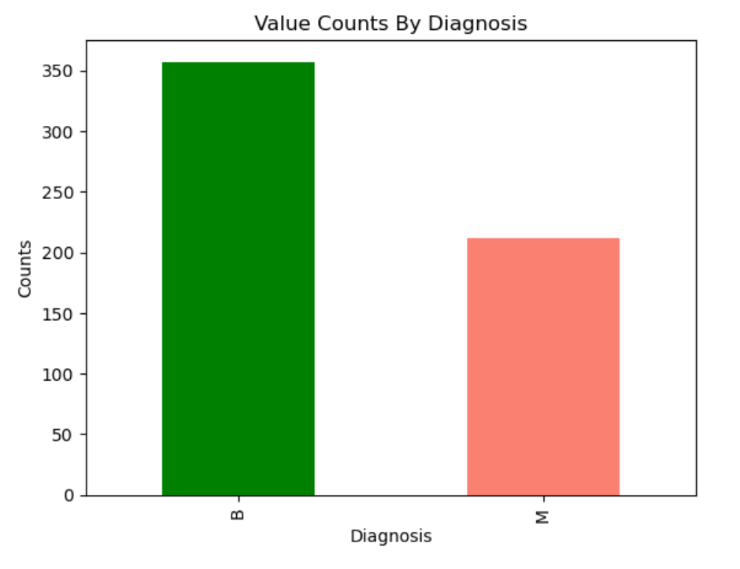
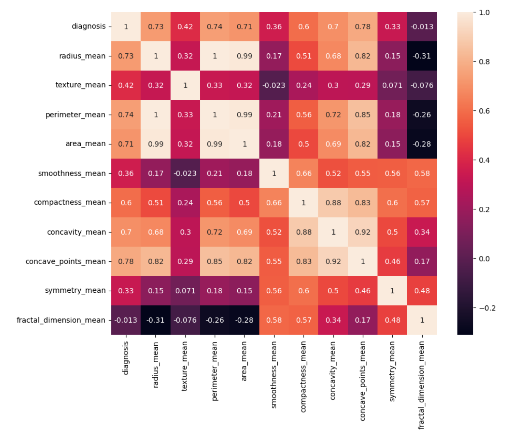

## **Main steps of the analysis**
- **Loading, analyze dataset and exclude highly correlated data:** Initial analysis and exclusion of highly correlated data.
- **Data preprocessing:** Scaling the data to ensure all features contribute equally to the clustering.
-  **Implementation of KMeans algorithm:**. 
   - **Determining the optimal number of clusters:** Applying the elbow method to select the appropriate number of clusters.
   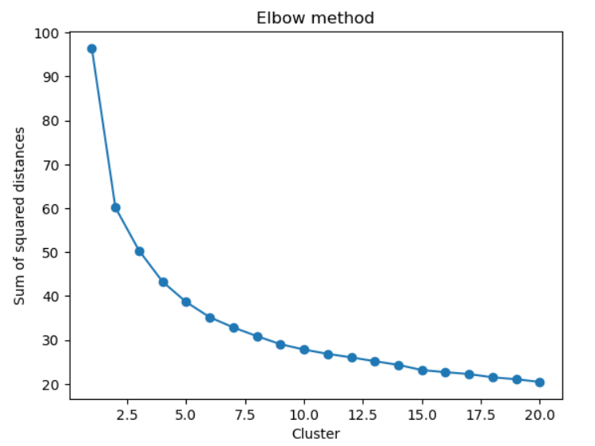
   - **Data clustering:** Performing clustering using KMeans algorithm.
- **Analysis of clusterization results:** Evaluation and interpretation of clusters, including analysis of dominant characteristics in each cluster.
- **Visualization:** Create charts to show clustering results.

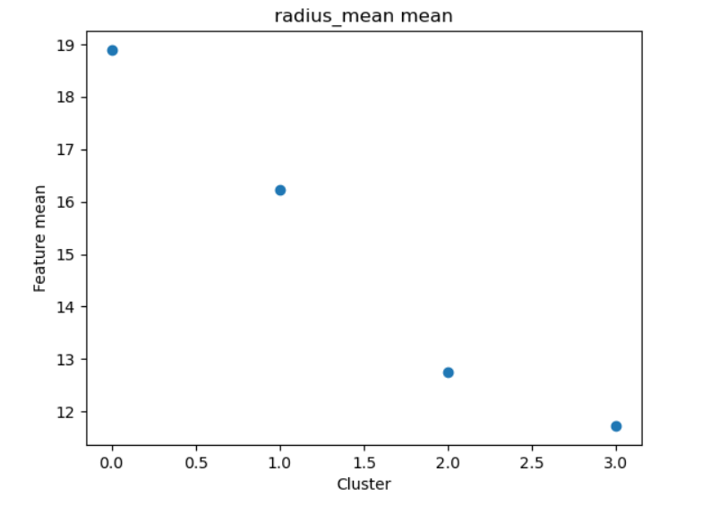
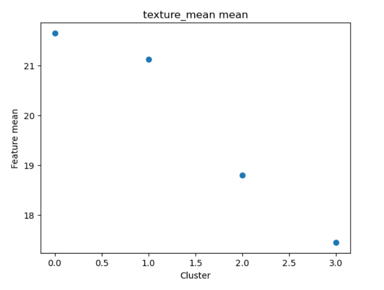
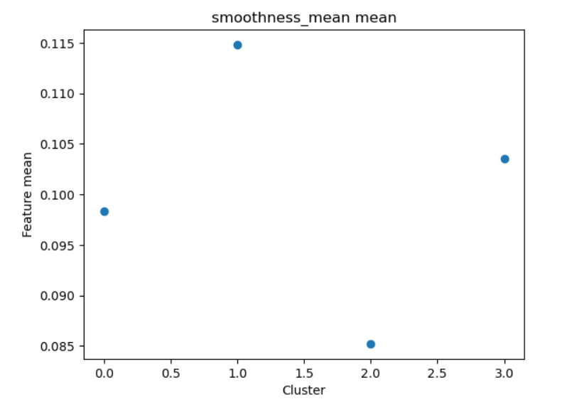
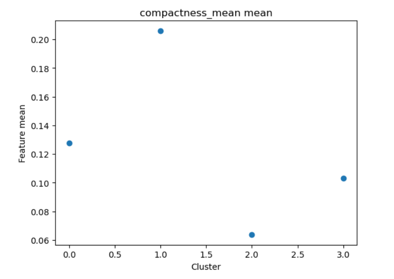
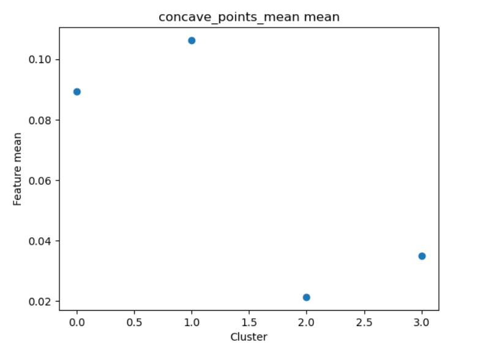
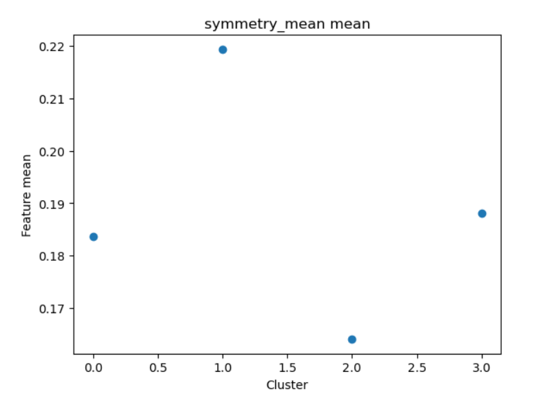
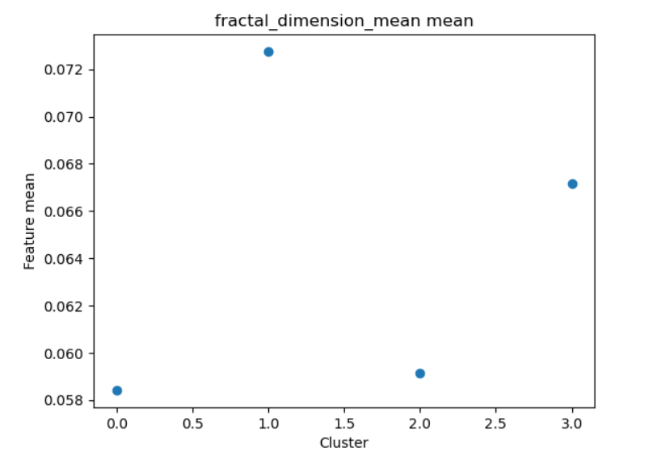

## **Results**
- **Cluster 0:** Mostly benign cases, with relatively lower values for most features, especially radius and texture. This suggests that smaller tumors, with lower texture values (smaller grayscale standard deviation), are more likely to be benign.
- **Cluster 1:** Also mostly benign, with slightly higher average feature values compared to cluster 0, but still relatively low, especially in terms of tumor radius and texture.
- **Cluster 2:** Mostly malignant cases, with high mean values for almost all features. Although there are no cases with the highest values of radius and texture, it has the highest values of other features, such as smoothness, compactness, concave points, symmetry or fractal dimension. This also indicates the malignancy of the tumors in this cluster, but their structure may be more irregular and complex than in Cluster 3.
- **Cluster 3:** Fully malignant cases, also characterized by very high average radius and texture values, suggesting that these features are strongly indicative of malignancy. The tumors in this cluster are the largest and have the most varied texture - indicating the presence of only malignant cases (115) and no benign cases in this cluster.

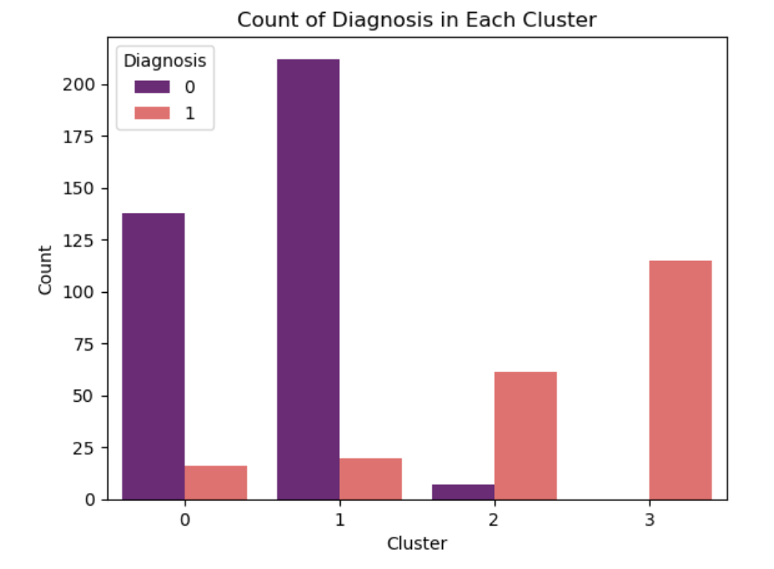

#### In conclusion, larger tumor dimensions and variation in texture are associated with greater malignancy. In addition, changes in the length of the radius, a more compact structure or a greater number of concave points on the tumor contour affect the nature of the tumor. Besides, repeated patterns in tumor irregularity (greater symmetry) and fractal dimension, which determines the complexity and irregularity of the tumor shape, are also important during analysis.

## **Opportunities for further development of the project**
- **Integration with other datasets:** You can consider combining your results with other medical databases to get a broader picture of different types of breast cancer and their characteristics.
- **Personalization of therapy:** Using clustering results to develop personalized treatment plans based on characteristics prevalent in each cluster.
- **Predictive analytics:** Development of predictive models that can predict disease development based on cluster data.
- **Use of other clustering algorithms e.g. DBSCAN**.
- **Use of dimensionality reduction algorithms:** Techniques such as PCA can help better understand data structure and improve clustering efficiency.
- **Development of recommendations for patients:** Based on the results of clustering, a recommendation system can be developed to suggest possible diagnostic and therapeutic paths for patients.

